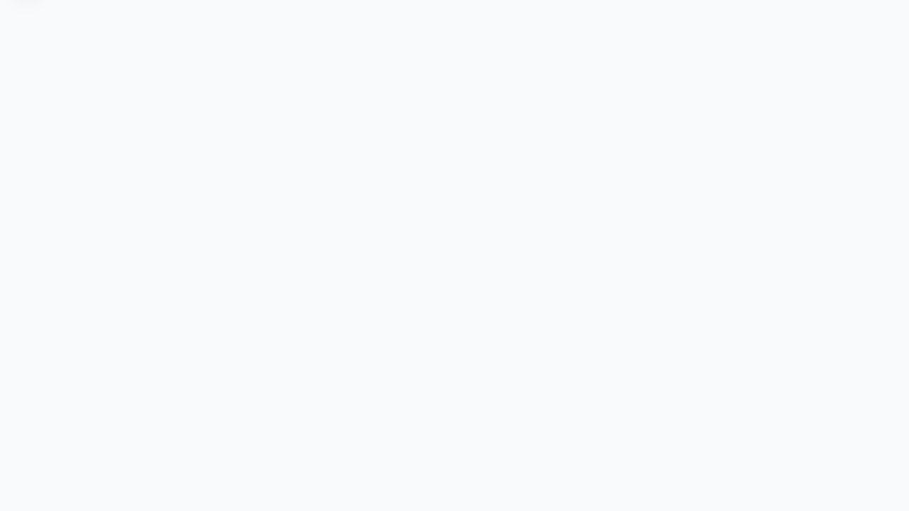
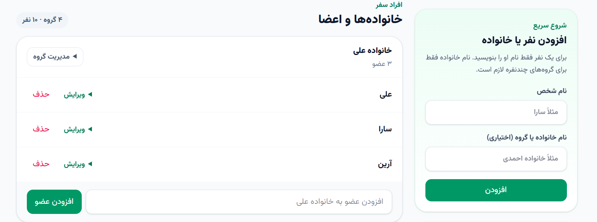
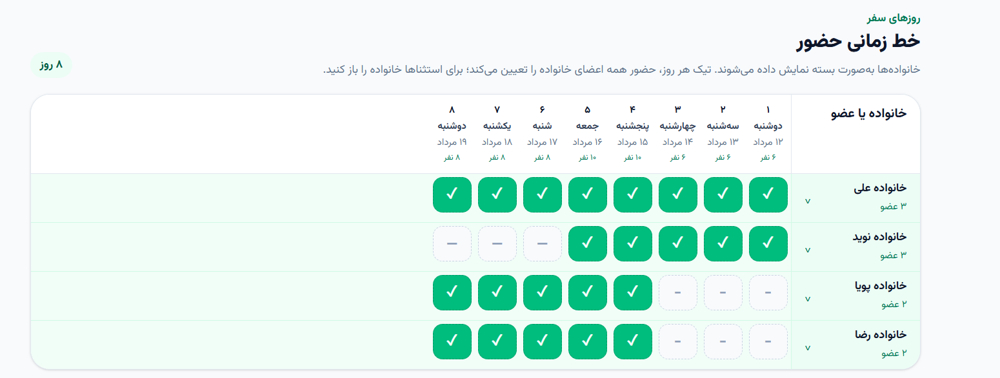
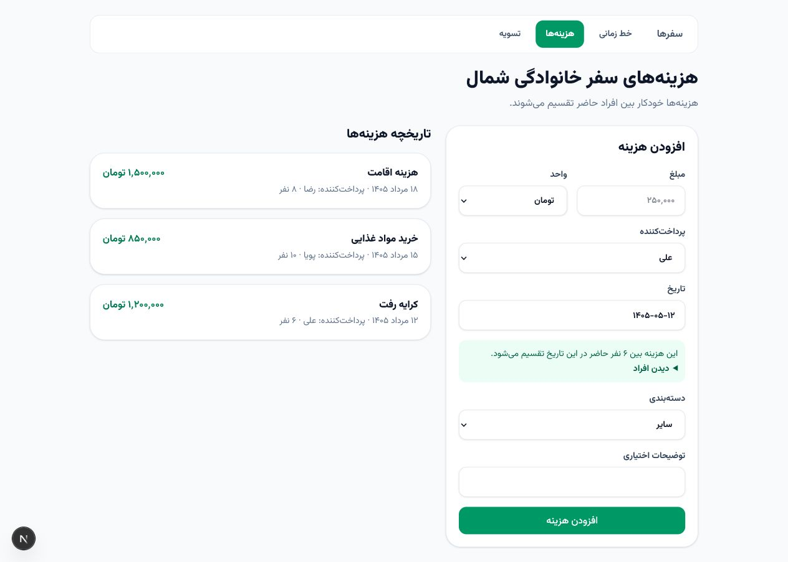
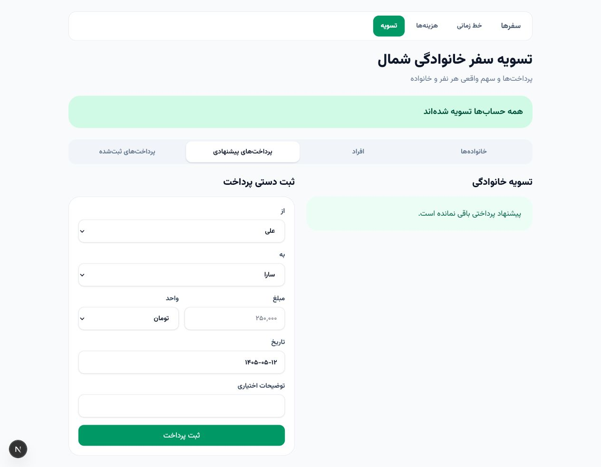

# دنگ (DONG)

دنگ حساب‌وکتاب سفرهای گروهی را ساده می‌کند. هزینه‌ها و پرداخت‌ها را ثبت می‌کنید و برنامه با توجه به مدت حضور هر نفر مشخص می‌کند چه کسی بدهکار است، چه کسی طلب دارد و در پایان چه پرداخت‌هایی باید انجام شود.

## فناوری‌ها

- Next.js 16 و React 19
- TypeScript و Tailwind CSS
- Prisma و SQLite
- Vitest و Playwright
- Docker و Nginx

## پیش‌نیازهای توسعه

- Node.js 22
- npm

## راه‌اندازی محیط توسعه

ابتدا وابستگی‌ها و Prisma Client را آماده کنید:

```bash
npm ci
npm run db:generate
npm run db:migrate
npm run db:seed
```

سپس برنامه را اجرا کنید:

```bash
npm run dev
```

برنامه در نشانی `http://localhost:3000` در دسترس است. دیتابیس توسعه در فایل `prisma/dev.db` ذخیره می‌شود.

## راهنمای استفاده

دنگ کمک می‌کند خرج‌های سفر را منصفانه بین همراهان تقسیم کنید. کافی است سفر و اعضا را ثبت کنید، روزهای حضور هر نفر را مشخص کنید و هزینه‌ها را وارد کنید. در پایان هم برنامه حساب می‌کند هرکس چقدر باید بپردازد یا دریافت کند.

### ۱. ساختن یا انتخاب سفر

در صفحه **سفرهای من** نام و تاریخ سفر را وارد کنید و واحد نمایش مبلغ را انتخاب کنید. هر سفر به شکل یک کارت نمایش داده می‌شود؛ با انتخاب آن، وارد صفحه مدیریت همان سفر می‌شوید.



### ۲. افزودن اعضا و تعیین حضور

در بخش **خط زمانی** می‌توانید یک نفر یا یک خانواده اضافه کنید. اگر نام گروه را خالی بگذارید، برنامه برای همان فرد یک گروه جداگانه می‌سازد. برای اضافه‌کردن نفرات بعدی، از کادر «افزودن عضو» پایین هر گروه استفاده کنید.



در جدول حضور، هر ستون مربوط به یک روز از سفر است. با زدن تیک یک خانواده، حضور همه اعضای آن خانواده در همان روز تغییر می‌کند. اگر حضور یکی از اعضا با بقیه فرق دارد، خانواده را باز کنید و روزهای حضور او را جداگانه تنظیم کنید. اگر بعد از ثبت هزینه، روزهای حضور را تغییر دهید، سهم هزینه‌ها خودکار به‌روز می‌شود.



### ۳. ثبت هزینه

در بخش **هزینه‌ها** مبلغ، پرداخت‌کننده، تاریخ و دسته‌بندی را وارد کنید؛ نوشتن توضیح اختیاری است. برنامه نشان می‌دهد در آن تاریخ چند نفر حضور داشته‌اند و هزینه را فقط بین همان افراد تقسیم می‌کند. هزینه‌های ثبت‌شده را هم می‌توانید ببینید، ویرایش کنید یا حذف کنید.



### ۴. تسویه و ثبت پرداخت

در بخش **تسویه** می‌بینید هر فرد یا خانواده چقدر بدهکار یا طلبکار است. در تب «پرداخت‌های پیشنهادی»، دنگ راه ساده‌تری برای تسویه حساب بین خانواده‌ها پیشنهاد می‌کند. می‌توانید همان پیشنهاد را ثبت کنید یا یک پرداخت را دستی وارد کنید. همه پرداخت‌های ثبت‌شده در تب «پرداخت‌های ثبت‌شده» قابل مشاهده و حذف هستند.



### نکته‌های مبلغ و تاریخ

- مبلغ را با واحد دلخواه وارد می‌کنید، اما برنامه آن را در پایگاه‌داده به ریال نگه می‌دارد.
- تاریخ‌ها با تقویم شمسی وارد و نمایش داده می‌شوند.
- بهتر است پیش از ثبت هزینه‌ها، اعضا و روزهای حضورشان را کامل کنید تا سهم‌ها دقیق محاسبه شوند.

## متغیرهای محیطی

نمونه تنظیم اتصال به SQLite:

```env
DATABASE_URL="file:./prisma/dev.db"
```

فایل‌های `.env` در Git ثبت نمی‌شوند و اطلاعات حساس نباید داخل مخزن قرار بگیرند.

## فرمان‌های کاربردی

| فرمان | کاربرد |
| --- | --- |
| `npm run dev` | اجرای محیط توسعه |
| `npm run build` | ساخت نسخه تولید |
| `npm start` | اجرای خروجی تولید |
| `npm run lint` | بررسی قواعد کدنویسی |
| `npm test` | اجرای تست‌های واحد |
| `npm run test:e2e` | اجرای تست‌های مرورگر |
| `npm run format` | قالب‌بندی فایل‌ها |
| `npm run db:generate` | تولید Prisma Client |
| `npm run db:migrate` | ایجاد و اجرای migration توسعه |
| `npm run db:seed` | ایجاد داده نمایشی |
| `npm run db:verify-seed` | بررسی صحت داده نمایشی |

برای نخستین اجرای تست مرورگر باید Chromium را نصب کنید:

```bash
npx playwright install chromium
```

## قواعد داده

- تمام مبلغ‌ها به‌صورت عدد صحیح و بر حسب ریال ذخیره می‌شوند.
- سهم هزینه هنگام ثبت ذخیره می‌شود.
- تغییر خط زمانی حضور افراد تنها پس از تأیید، سهم‌ها را بازسازی می‌کند.
- مانده‌ها از هزینه‌ها، سهم‌ها و پرداخت‌ها محاسبه می‌شوند و جداگانه در دیتابیس ذخیره نمی‌شوند.
- مجموع مانده تمام افراد باید همواره صفر باشد.

## ساخت ایمیج تولید

ایمیج production از خروجی standalone خود Next.js استفاده می‌کند و ابزارهای توسعه یا کل `node_modules` را در خود نگه نمی‌دارد:

```bash
docker build --target production -t dong:1.0.0 .
```

اجرای برنامه با Compose:

```bash
DONG_IMAGE=dong:1.0.0 docker compose up -d
```

دیتابیس در volume داکر به نام `dong-data` نگهداری می‌شود و با تعویض کانتینر حذف نخواهد شد.

## استقرار روی سرور بدون اینترنت

برای هر انتشار از یک شماره نسخه جدید استفاده کنید و ایمیج را روی سیستم توسعه بسازید:

```powershell
docker build --target production -t dong:1.0.1 .
docker save -o dong-1.0.1.tar dong:1.0.1
tar -czf dong-1.0.1.tar.gz dong-1.0.1.tar
scp -P 9011 dong-1.0.1.tar.gz pouya@SERVER:/home/pouya/dong/
```

روی سرور ایمیج را بارگذاری کنید:

```bash
cd /home/pouya/dong
tar -xOzf dong-1.0.1.tar.gz | docker load
```

اگر رجیستری داخلی در دسترس است، روش بهتر push و pull کردن ایمیج نسخه‌دار است؛ داکر در این روش فقط لایه‌های تغییرکرده را منتقل می‌کند:

```bash
docker build --target production -t REGISTRY/dong:1.0.1 .
docker push REGISTRY/dong:1.0.1
```

## انتشار بدون قطعی

نسخه جدید را کنار نسخه فعال اجرا کنید:

```bash
docker run -d \
  --name dong-green \
  --restart unless-stopped \
  --network dong_default \
  -e NODE_ENV=production \
  -e PORT=3000 \
  -e HOSTNAME=0.0.0.0 \
  -e DATABASE_URL=file:/data/dong.db \
  -v dong_dong-data:/data \
  dong:1.0.1
```

پیش از انتقال ترافیک، نسخه جدید را از داخل شبکه داکر بررسی کنید. سپس upstream پراکسی را به `dong-green:3000` تغییر دهید و تنظیمات پراکسی را بدون restart مجدد بارگذاری کنید. کانتینر قبلی را فقط پس از موفقیت بررسی عمومی حذف کنید.

دو نسخه نباید برای مدت طولانی هم‌زمان روی یک دیتابیس SQLite بنویسند.

## migration دیتابیس تولید

فقط زمانی که فایل‌های `prisma/migrations` تغییر کرده‌اند، target مخصوص migration را بسازید:

```bash
docker build --target migration -t dong-migrate:1.0.1 .
```

پیش از اجرای migration از دیتابیس نسخه پشتیبان تهیه کنید. سپس migration را روی همان volume برنامه اجرا کنید:

```bash
docker run --rm \
  -e DATABASE_URL=file:/data/dong.db \
  -v dong_dong-data:/data \
  dong-migrate:1.0.1
```

تغییرات دیتابیس در انتشار بدون قطعی باید با نسخه فعلی و نسخه جدید برنامه سازگار باشند.

## بررسی سلامت انتشار

```bash
docker logs --tail 100 dong
curl -fI http://dong.psamie.ir/
curl -fI http://dong.psamie.ir/trips
```

پاسخ موفق باید وضعیت `200 OK` داشته باشد.

## PWA

نسخه تولید سرویس‌ورکر و پوسته آفلاین را ثبت می‌کند. برای بررسی رفتار نسخه production در محیط محلی، ابتدا `npm run build` و سپس `npm start` را اجرا کنید.
